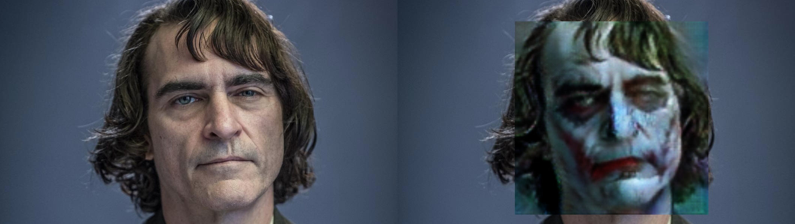

# Jokerise with CycleGAN



Not sure if Joker face would look good on you for Halloween?
[Try jokeriser!](https://jokerise.hyojun.me)

Jokerise finds your face with [facenet_pytorch](https://github.com/timesler/facenet-pytorch)
and translate your face to a Joker's using a generator trained with [CycleGAN](https://arxiv.org/pdf/1703.10593.pdf).

## Getting Started

There is a [another repository](https://github.com/devinjeon/jokerise-web)
which implements this project as a web service.

You can also jokerise your photo in [the web service](https://jokerise.hyojun.me)

### Install

```bash
$ git clone https://github.com/junkwhinger/jokerise.git
$ cd jokerise
$ pip install -e . # python version >= 3.6
```

### How to jokerise

```bash
# image
$ ./demo.py --input samples/joaquin.jpg

# video
$ ./demo.py --input samples/joaquin.mp4

# webcam
$ ./demo.py --webcam

# wanna see original & tranlsated version side by side?
$ ./demo.py --webcam --show-original
```

### Note

- Works well on Ubuntu 18.04 LTS and OSX environment.
  - Not sure about other platforms.

## CycleGAN Training Details

- Dataset
  - Joaquin Phoenix's and Heath Ledger's joker faces from Google (300 images)
  - Randomly selected faces from CelebA dataset (300 images)
- Preprocessing
  - cropped faces with [OpenCV](https://www.pyimagesearch.com/2018/02/26/face-detection-with-opencv-and-deep-learning/)
- Training details
  - image size: 3x128x128
  - number of residual blocks: 6
  - epochs: 200

## Have Fun!


## Reference

- Detectron2 https://github.com/facebookresearch/detectron2/tree/master/detectron2
- CycleGAN https://github.com/junyanz/pytorch-CycleGAN-and-pix2pix/tree/master/models
- facenet-pytorch https://github.com/timesler/facenet-pytorch
- Face detection with OpenCV and deep learning https://www.pyimagesearch.com/2018/02/26/face-detection-with-opencv-and-deep-learning/
